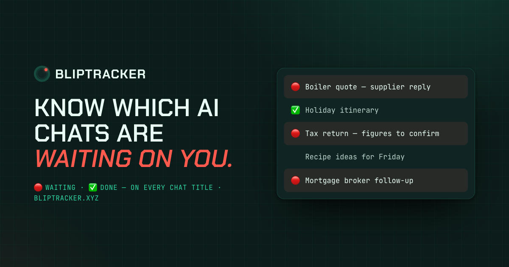
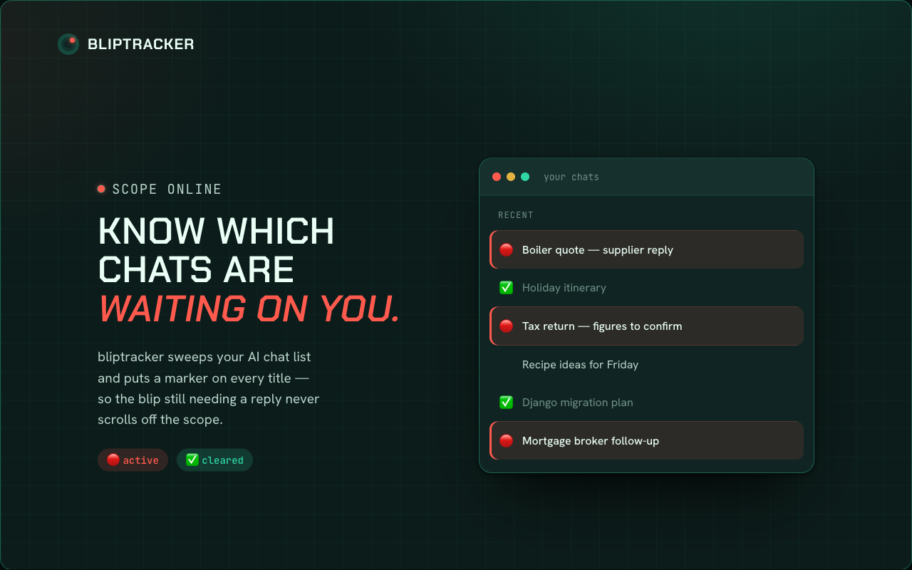
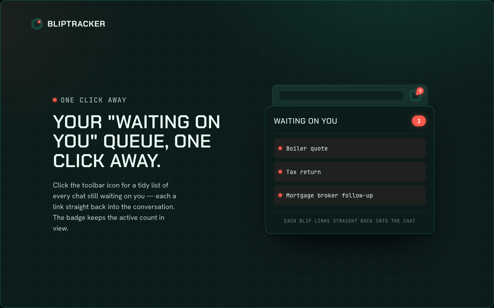
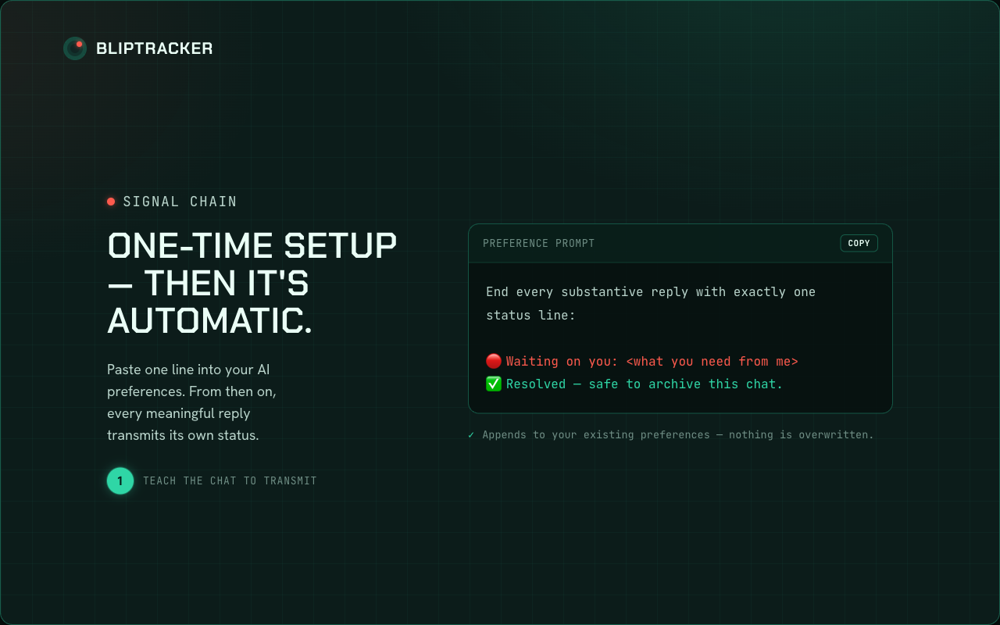

# bliptracker

[](https://chromewebstore.google.com/detail/bliptracker/dhbhcgiohdpemjhlcmldipoioafeeemj)
[](https://chromewebstore.google.com/detail/bliptracker/dhbhcgiohdpemjhlcmldipoioafeeemj)
[](https://chromewebstore.google.com/detail/bliptracker/dhbhcgiohdpemjhlcmldipoioafeeemj)
[](LICENSE)

**bliptracker is the scope for your AI chats** — a Chrome extension that labels your
[claude.ai](https://claude.ai) conversations with a 🔴 / ✅ prefix so you can see at a
glance which ones are **waiting on you** versus done — on desktop and on mobile.
→ [**bliptracker.xyz**](https://bliptracker.xyz)

> ⚠️ Unofficial community tool. Not affiliated with or endorsed by Anthropic. It uses
> undocumented claude.ai endpoints and may break without notice.

[](https://bliptracker.xyz)

## Install

**[➕ Add to Chrome](https://chromewebstore.google.com/detail/bliptracker/dhbhcgiohdpemjhlcmldipoioafeeemj)** — the easy way.

<details>
<summary>Or load from source (unpacked)</summary>

1. Clone or download this repo.
2. Go to `chrome://extensions` → enable **Developer mode** → **Load unpacked** →
   select the `extension/` folder.
3. A setup tab opens automatically — copy the preference prompt into your Claude
   profile settings (it links you straight there).
</details>

After installing, do the one-time setup (below) and you're done.

## Demo

<!-- TODO: once recorded, replace this block with:  -->
▶️ A short walkthrough GIF is coming. Recording spec:
[marketing/demo-gif-spec.md](marketing/demo-gif-spec.md).

## Screenshots

| Waiting-on-you, labelled | The queue popup | One-time setup |
| --- | --- | --- |
|  |  |  |

## How it works

1. A one-time **preference prompt** in your Claude profile makes Claude end
   substantive replies with a machine-readable marker:
   `🔴 Waiting on you: <reason>` or `✅ Resolved — safe to archive`. This runs
   everywhere you use Claude, including mobile.
2. The extension reads that marker and renames the chat title with a `🔴` / `✅`
   prefix. Because titles are stored server-side, the labels **sync to the
   claude.ai mobile app** automatically — you only run the extension on desktop.
3. Click the toolbar icon for a **“waiting on you” queue** of your 🔴 chats; the
   badge shows the count.

Classification is deterministic — a string match on the marker Claude wrote,
never an after-the-fact guess.

## Settings

Right-click the toolbar icon → **Options** (or the **Settings** link in the
popup):

- **Enabled** — master switch.
- **Mirror status to stars** — also star 🔴 chats / unstar ✅ ones, so the
  Starred section is your mobile queue. _Off by default_ so it doesn't collide
  with stars you set manually.
- **Sweep interval** — how often to re-check all chats. The chat you're actively
  viewing updates instantly regardless.

## Architecture

Three layers, each with one job:

- **Orchestrator** (`extension/lib/orchestrator.js`) — platform-agnostic. Owns
  the sweep, the on-demand re-check, the `seen` cache and the badge. Knows only
  the adapter interface, never an endpoint.
- **Service adapters** (`extension/adapters/*.js`) — one per platform, running
  in the service worker. Own endpoints, auth and response parsing, and
  normalise everything to `{id, name, isStarred, updatedAt, lastAssistantText,
  isTemporary}`. Registered in `adapters/index.js`.
- **DOM adapters** (the `DOM_ADAPTERS` map in `extension/content.js`) — one
  entry per host, running in the page. Own selectors: `currentId(location)` and
  `titleNodes(id)`.

The split follows a process boundary, not just a file boundary: service
adapters need the worker's cookie context, DOM adapters need the page. That's
why `content.js` carries its own map rather than importing the registry.

Beyond the layering:

- **Two triggers, one brain.** `content.js` (instant, the chat you're viewing)
  and the alarm sweep (periodic, all chats incl. mobile-finished) both funnel
  through `checkConversation`/`applyStatus` in the orchestrator. No classify or
  rename logic is duplicated in the content script.
- **Idempotent renames.** Renaming bumps a chat's `updated_at`, so the next
  sweep re-checks it — `titleTransform()` is idempotent, so the re-check is a
  no-op. Convergence by design, no bookkeeping.
- **Best-effort DOM paint.** The instant sidebar update writes to the page's
  DOM; if React reverts it, the resulting mutation re-triggers our observer and
  we re-apply. The server-side rename is the source of truth regardless.
- **No backend.** All requests go directly to the platform with your own
  session; nothing is sent anywhere else. See [PRIVACY.md](PRIVACY.md).

## Confirmed endpoints (recon 2026-06-12)

Used only by the Claude service adapter (`extension/adapters/claude.js`); no
other module references them. All under `/api/organizations/{orgId}`:

| Method | Path | Use |
| --- | --- | --- |
| GET | `/chat_conversations?limit=N` | list (incl. `updated_at`, `is_starred`) |
| GET | `/chat_conversations/{uuid}` | full chat incl. `chat_messages[]` |
| PUT | `/chat_conversations/{uuid}` `{"name":…}` | rename |
| PUT | `/chat_conversations/{uuid}` `{"is_starred":bool}` | star |
| DELETE | `/chat_conversations/{uuid}` | delete (unused) |

## Roadmap

See [ROADMAP.md](ROADMAP.md) for shipped features, what's next, and planned
future work (e.g. a popup "Resolve" button, one-click preference injection,
bulk-archive, and multi-AI adapters).

## Development

Pure JS, no build step, no dependencies. Load `extension/` unpacked at
`chrome://extensions`.

Tests use Node's built-in runner (Node ≥ 20):

```sh
npm test          # node --test 'tests/**/*.test.mjs'
```

`tests/helpers/` holds a ~50-line `chrome` stub and an in-memory fake adapter,
so the orchestrator can be driven without a browser. Adding a platform means
writing a service adapter and a DOM adapter — see
[ROADMAP.md](ROADMAP.md#adding-a-platform-the-adapter-recipe).

## Feedback & contributing

Found a bug, or got an idea? **[Open an issue](https://github.com/softwarecrafts/blip/issues)** —
feedback on the onboarding especially welcome. PRs are warmly received; it's a
small, no-build codebase, so jump straight in.

## License

[MIT](LICENSE) © 2026 Andrew Miller
